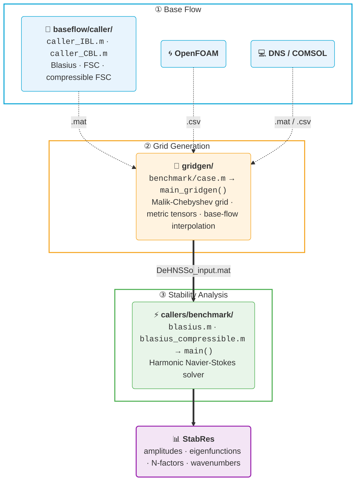

# DeHNSSo v2

**Delft Harmonic Navier-Stokes Solver** — nonlinear stability analysis of laminar boundary layers over surfaces with complex geometric features.

This is an extended and refactored version of [DeHNSSo](https://doi.org/10.1016/j.cpc.2024.109250) by Westerbeek, Hulshoff, Schuttelaars & Kotsonis (2024).

> **Paper in preparation.** For questions about the method or implementation, contact **Pietro Carlo Boldini** — P.C.Boldini@tudelft.nl

**Last updated:** June 2026

## Recent updates (June 2026)

- **`Opt.rerun` reuses the LU factorisation cache** — amplitude/forcing sweeps on a fixed base flow now skip both assembly and factorisation (~6× faster reuse). See [docs/user_guide.md](docs/user_guide.md) §9

## Recent updates (May 2026)

- **Compressible mode** — full (u, v, w, ρ, T) HNS path (Scholten 2024). Validated against incompressible LST in the Ma → 0 limit (Bertolotti) and against the Zanus/Bertolotti 2017 PSE benchmarks at Ma=0.5, 1.6, and 4.5 (Ma=0.5 case shipped as `blasius_compressible`)
- **CBL solver** — compressible Falkner-Skan-Cooke similarity; new `baseflow/caller/` layout splits IBL and CBL entry points
- **Compressible callers** — `gridgen/benchmark/blasius_compressible.m` + `callers/benchmark/blasius_compressible.m` with built-in HNS vs Zanus/Bertolotti PSE plot
- **`lapack_band` LU mode** — LAPACK banded LU MEX (`src/hns/dgbsv_solve.c`), ~3× faster than `seq` on compressible TS. Build via `src/hns/mexbuild_dgbsv.m`
- **`block`/`band` LU modes removed** — `block` was silently wrong on ill-conditioned boundary stencils; `band` was redundant with `seq`
- **Docs** — `docs/user_guide.md` and `docs/developer_guide.md` updated for compressible mode and `lapack_band` MEX

## Recent updates (April 2026)

- **Validation status** — three reference cases from Westerbeek et al. 2024 reproduce end-to-end: nonlinear TS waves in a Blasius BL (Fig. 8), nonlinear stationary CFI on a swept-wing flat plate (Fig. 9), and linear stationary CFI over a smooth hump (Fig. 10). See [docs/reference_cases.md](docs/reference_cases.md) for replication instructions
- **New grid-generation pipeline** — flat-plate, body-fitted curvilinear, and unstructured CFD scatter (e.g. OpenFOAM)
- **Nonlinear solver** — AF-continuation Picard with damping, optional Anderson acceleration, and JFNK Newton fallback
- **Crossflow instability** — full M3J swept curved-wall case end-to-end
- **Non-uniform streamwise grids** — per-station Fornberg weights and sparse `D_xi`
- **Repository restructured** — `input/` + `literature/` split; per-case scripts under `*/benchmark/`

## New features in v2

### Geometry and mesh
- **Grid generation pipeline** (`gridgen/`) — builds structured Malik-Chebyshev stability grids and interpolates base-flow data; supports flat-plate similarity solutions, curvilinear body-fitted meshes, and external CFD imports (e.g., OpenFOAM)
- **Curvilinear coordinates** — perturbation equations formulated in general body-fitted coordinates (ξ, η) with numerically computed first- and second-order inverse metric tensors
- **Elliptic mesh smoother** — Laplace-based grid smoothing via successive over-relaxation, enabling body-fitted meshes on concave surfaces without grid folding

### Boundary conditions
- **Per-component freestream BC** — `Opt.bc_top` is a cell array `{'H_DR', 'H_DR', 'H_DR'}` specifying the BC type for each velocity component (u, v, w) independently:
  - `'H_DR'` — homogeneous Dirichlet (q = 0, default)
  - `'IH_DR'` — inhomogeneous Dirichlet (q = value from `Stab.bct`)
  - `'H_NM'` — homogeneous Neumann (dq/dy = 0)
- **Wall actuation** — inhomogeneous Dirichlet BC at the wall (blowing/suction, streamwise or spanwise forcing) via `Stab.bcw`
- **Freestream forcing** — inhomogeneous Dirichlet BC at `y = H` (acoustic waves, free-stream turbulence) via `Stab.bct`; requires `'IH_DR'` on the forced component
- **Mixed BCs** — different BC types per component enable receptivity studies (e.g., `{'H_DR', 'IH_DR', 'H_DR'}` forces v at freestream while u and w decay to zero)
- **Backward compatible** — scalar `'dirichlet'` / `'neumann'` strings are auto-converted to the per-component format

### Inflow
- **Phase reference** — inflow eigenfunction phase can be referenced to wall pressure (`'pwall'`) or streamwise velocity maximum (`'umax'`) via `Stab.phaseRef`
- **Simplified amplitude interface** — set `Stab.A0_fund` (scalar) instead of manually building the full amplitude vector with `ModeToModeNumber`; conjugate pairs are built automatically in `init.m`

### Spectral content
- **3D support** — spanwise wavenumber modes (N > 0) fully supported for cross-flow instability analysis; beta-dependent LHS terms assembled as separate matrices (MLA3, MLA4) and combined at solve time

### Solver modes
- **Linear mode** — `Opt.linear = 'on'` disables nonlinear terms (NLT) and converges in a single iteration; equivalent to linear PSE. Default is `'off'` (nonlinear)

### Compressible mode
- **Compressible HNS** — `Opt.compressible = 'on'` activates the full (u, v, w, ρ, T) path (Scholten et al. 2024 density formulation). Pressure perturbation eliminated via the EOS; ρ is a direct state variable. Validated against incompressible LST (Bertolotti) in the Ma → 0 limit and against the Zanus/Bertolotti 2017 PSE M=0.5 benchmark; additional sanity tests at Ma=1.6 and Ma=4.5
- **Compressible base flow** — `baseflow/CBL/compressibleFSC.m` solves the compressible Falkner-Skan-Cooke similarity problem (adiabatic or isothermal walls, Sutherland viscosity)
- **Compressible inflow** — CLST eigenvalue solver with Mack F/S mode selection (`Opt.mode_select = 'slow' | 'fast'`) and continuous-spectrum branch rejection
- **Chu/Mack disturbance energy** — `Opt.plot_metric = 'energy'` plots √E with the compressible energy norm

### Computational efficiency
- **LHS matrix reuse** — pass the assembled LHS back across calls via `Opt.rerun = 'on'`; avoids full matrix reassembly for parameter sweeps (amplitude, actuation, frequency)
- **LU mode selection** — `Opt.lu_mode` picks the linear-solver strategy:
  - `'full'` — cache every LU factorisation (fastest reuse, unbounded memory)
  - `'auto'` — LRU cache bounded by `Opt.lu_max_cache` (default for nonlinear runs)
  - `'lapack_band'` — LAPACK `zgbsv`/`dgbsv` MEX (banded LU with partial pivoting); ~3× faster than `seq`. Build once via `src/hns/mexbuild_dgbsv.m`
  - `'seq'` — one LU per mode group, discard after solve (low memory; required for compressible 5-var on tight RAM)
  - `'none'` — backslash each time (reference / debug)
- **Parallel assembly and solve** — `Opt.parfor = 'on'` parallelises LHS station assembly and mode solve (auto-detected; requires Parallel Computing Toolbox)
- **GPU acceleration** — `Opt.gpu = 'on'` solves on GPU via `gpuArray \`; beneficial for ny >= 80 on NVIDIA GPUs (auto-detected; requires PCT)
- **MFD_diff compression** — the mean-flow distortion LHS is stored as a difference matrix, reducing stored memory by 49%
- **7.7x speedup** over the heritage version (Blasius test case, nx=800, ny=40, M=1)

### Code quality
- **Modular structure** — refactored from a monolithic 900-line function into ~15 focused files organised by functionality (`src/init`, `src/hns`, `src/convergence`, `src/plot`, `src/math`)
- **Documented caller** — `callers/benchmark/blasius.m` is organised into labelled sections (spectral content, inflow, boundary conditions, buffer, solver options, performance, run, post-processing)

## Directory structure

```
DeHNSSo/
├── callers/
│   └── benchmark/               — Reference example callers (blasius.m, blasius_compressible.m, ...)
├── input/                       — Stability grid input (DeHNSSo_input.mat | DeHNSSo_input_compressible.mat)
├── literature/                  — Reference data for validation plots (PSE, DNS, LPSE, Zanus/Bertolotti)
├── src/                         — Solver source code
│   ├── main.m                   — Main solver entry point
│   ├── init/                    — Initialisation, inflow (ILST/CLST), boundary conditions
│   ├── hns/                     — Core HNS: LHS, LHS_compressible, RHS, solve, NLT, dgbsv_solve MEX
│   ├── convergence/             — Iteration control, amplitude damping, convergence checks
│   ├── thermo/                  — Sutherland viscosity (compressible)
│   ├── io/                      — Post-processing, configuration printing
│   ├── plot/                    — Intermediate, convergence, and final amplitude plots
│   └── math/                    — Finite differences, Chebyshev operators
├── gridgen/                     — Grid generation and base-flow preprocessing
│   ├── main_gridgen.m           — Pipeline entry point
│   ├── benchmark/               — Per-case scripts: blasius.m, blasius_compressible.m, sweptwing_flat.m, ...
│   └── src/                     — Mesh, metric tensors, resampling (ρ/T pass-through), elliptic smoother
├── baseflow/                    — Boundary-layer solvers
│   ├── caller/                  — Entry points: caller_IBL.m, caller_CBL.m
│   ├── IBL/                     — Incompressible BL (Blasius, Falkner-Skan-Cooke)
│   ├── CBL/                     — Compressible BL (compressible FSC + Sutherland)
│   └── output/                  — Generated base flows (bf_blasius.mat, BF_compressible.mat, ...)
└── docs/                        — User guide and developer guide
```

## Workflow



### 1. Generate base flow

```matlab
cd baseflow/caller/
caller_IBL      % incompressible (Blasius, FSC) → baseflow/output/bf_blasius.mat
caller_CBL      % compressible (FSC + Sutherland) → baseflow/output/BF_compressible.mat
```

Or provide base-flow data from an external CFD solver (OpenFOAM, DNS, COMSOL, ...).

### 2. Build stability grid

The `gridgen/` pipeline builds the stability grid (Malik-Chebyshev wall-normal, FD streamwise) and interpolates the base flow onto it. Per-case scripts in `gridgen/benchmark/` configure the inputs and call `main_gridgen()`. Supported input types: Cartesian structured (`.mat`), curvilinear structured body-fitted (`.mat`), and unstructured CFD scatter (`.csv`).

```matlab
cd gridgen/benchmark/
blasius                 % Cartesian Blasius BL (.mat)
blasius_compressible    % Cartesian compressible FSC BL (.mat) — passes ρ/T/μ through
blasius_csv             % Cartesian Blasius BL from OpenFOAM CSV (flat-lattice scatter)
sweptwing_flat          % curvilinear flat-plate swept BL
sweptwing_hump          % curvilinear swept BL over a Gaussian hump
m3j                     % unstructured OpenFOAM scatter (M3J curved wall)
```

For dimensional CFD imports (e.g. OpenFOAM CSV) the cartesian path supports `params.rescale = true` with `Uref`/`lref` (X/Y divided by `lref`, U/V/W by `Uref` before interpolation), `params.interp_method` (`'makima'` default — handles non-uniform wall-clustered spacing without overshoot), and `params.xi_trim_inflow`/`xi_trim_outflow` for trimming noisy CFD BC regions. See [docs/user_guide.md](docs/user_guide.md) §1c.

Reference base-flow data lives in `baseflow/output/benchmark/` (committed; the rest of `baseflow/output/` stays a scratch area for `baseflow/caller/caller_IBL.m` and `caller_CBL.m` runs).

### 3. Run stability analysis

**First-time setup (optional).** If using the fastest LU mode `Opt.lu_mode = 'lapack_band'` (recommended for compressible TS), build the MEX once per machine:

```matlab
run('src/hns/mexbuild_dgbsv.m')   % needs MATLAB ≥ R2018a and a C compiler configured for mex
```

Otherwise the caller errors with a clear message; fall back to `Opt.lu_mode = 'seq'` if no compiler is available.

Per-case stability scripts in `callers/benchmark/` share an identical structure (Setup → Spectral content → Inflow → BCs → Buffer → Solver → Performance → Run → Post-processing) and differ only in case-specific parameter values:

```matlab
cd callers/benchmark/
blasius                 % TS waves in Blasius BL
blasius_compressible    % compressible TS waves (overlays Zanus/Bertolotti 2017 PSE M=0.5 reference)
sweptwing_flat          % stationary CFI on flat-plate swept BL
sweptwing_hump          % stationary CFI over a hump on swept BL
m3j                     % stationary CFI on M3J curved swept-wing BL
```

## Key solver options

Set in the caller before calling `main()`:

| Parameter | Default | Description |
|---|---|---|
| `Stab.M` | — | Spectral truncation: temporal modes |
| `Stab.N` | — | Spectral truncation: spanwise modes |
| `Stab.omega_0` | — | Fundamental angular frequency |
| `Stab.beta_0` | — | Fundamental spanwise wavenumber |
| `Stab.IC` | `'ILST'` | Inflow: `'ILST'` (incompressible) / `'CLST'` (compressible) / `'LOAD'` |
| `Stab.A0_fund` | — | Fundamental mode amplitude (scalar) |
| `Opt.compressible` | `'off'` | Compressible mode: `'on'` activates (u,v,w,ρ,T) path |
| `Opt.bc_top` | `{'H_DR','H_DR','H_DR'}` | Freestream BC per component {u,v,w} (incompressible) or {u,v,w,T} (compressible) |
| `Opt.bc_wall_thermal` | `'isothermal'` | Wall thermal BC (compressible only) |
| `Opt.mode_select` | `'auto'` | Mack mode pick at Ma>1: `'slow'` / `'fast'` / `'auto'` |
| `Opt.buffer` | `'on'` | Buffer type: `'on'`, `'para'` (required at Ma>0), `'off'` |
| `Opt.xb` | 85 | Buffer start (% of domain) |
| `Opt.Conv` | `1e-4` | Convergence criterion |
| `Opt.lu_mode` | `'full'` | LU strategy: `'lapack_band'` / `'full'` / `'auto'` / `'seq'` / `'none'` |
| `Opt.rerun` | `'off'` | Reuse LHS: `'on'` or `'off'` |
| `Opt.parfor` | auto | Parallel: `'on'` or `'off'` |
| `Opt.gpu` | auto | GPU solve: `'on'` or `'off'` |
| `Opt.linear` | `'off'` | Linear mode: `'on'` or `'off'` |
| `Opt.plot` | `'on'` | Plots: `'on'` or `'off'` |
| `Opt.plot_metric` | `'umax'` | Amplitude metric: `'umax'` / `'urms'` / `'energy'` (Chu/Mack for compressible) |

See [docs/user_guide.md](docs/user_guide.md) for a full parameter reference.

## Performance

Blasius BL test case (nx=800, ny=40, M=1, sequential):

| Metric | Heritage | v2 |
|---|---|---|
| Total time | 194.7 s | 25.2 s (**7.7x faster**) |
| LHS stored memory | 224.4 MB | 115.4 MB (**49% less**) |
| Non-LHS memory | 54.4 MB | 10.6 MB (**5.1x less**) |

For the nonlinear case (M=5): heritage 785.8 s -> v2 88.5 s (**8.8x faster**).

SweptWing CFI nonlinear (M=0, N=5, 6 modes, nx=1200, ny=40, single-thread):

| Metric | Heritage (Westerbeek 2024 Table A.1, 8-core / 32 GB) | v2 (Apple Silicon, 32 GB) |
|---|---|---|
| Total time | 4644 s (1.29 h) | 303 s (**~15x faster**) |
| Iterations | — | 65 Picard |
| Peak memory | — | 15.1 GB |

Compressible TS, M=0.5 Zanus/Bertolotti benchmark (M=1, nx=800, ny=81, Apple Silicon, 32 GB):

| Metric | `seq` (sparse LU) | `lapack_band` (MEX) |
|---|---|---|
| Total wall | 226 s | **71 s (3.2× faster)** |
| LU + solve | 211 s | 57 s |
| Peak memory | ~8 GB | ~20 GB |

## Documentation

- [docs/user_guide.md](docs/user_guide.md) — how to configure and run cases
- [docs/developer_guide.md](docs/developer_guide.md) — code architecture, data structures, how to extend
- [docs/reference_cases.md](docs/reference_cases.md) — replication instructions for the three validated cases (Blasius TS, swept-wing flat CFI, swept-wing hump CFI)

## Roadmap

- **Discrete adjoint** — receptivity and sensitivity analysis (in progress)
- **Compressible extensions** — Newton/JFNK and adjoint operators for the (u,v,w,ρ,T) path (currently Picard-only)
- **HNS → PSE coupling** — HNS upstream + linear PSE downstream marcher for cheaper long-domain runs

Contact P.C.Boldini@tudelft.nl if interested in contributing.

## References

- S. Westerbeek, S. Hulshoff, H. Schuttelaars, M. Kotsonis. *DeHNSSo: The Delft Harmonic Navier-Stokes Solver for nonlinear stability problems with complex geometric features.* Computer Physics Communications 302, 109250 (2024). [DOI](https://doi.org/10.1016/j.cpc.2024.109250)

## License

MIT License — see [LICENSE](LICENSE).
